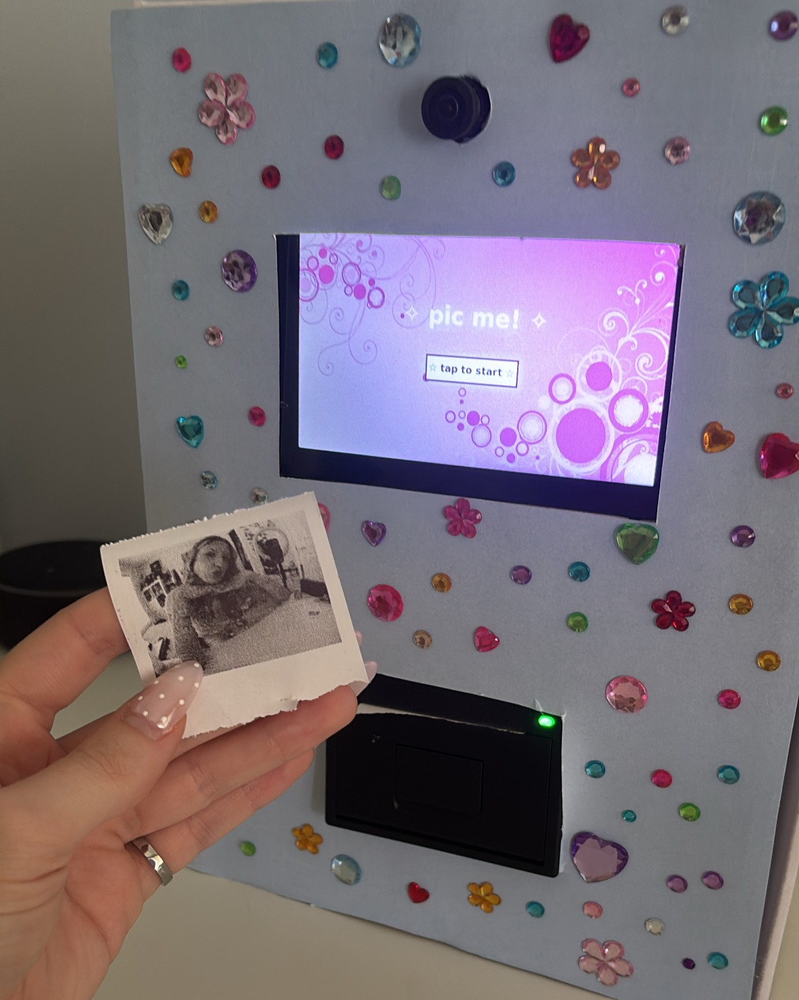

# Thermal Photobooth
A portable, battery-powered photobooth built on a Raspberry Pi 4B. Captures a photo through a fisheye lens, applies a 1-bit dithered black-and-white filter, and instantly prints it on embedded thermal receipt paper — all through a custom touchscreen UI.


| Idle screen | Printing screen |
|---|---|
|  |  |


## Features

- Fisheye photo capture via Raspberry Pi Camera Module (CSI)
- Live camera preview during an on-screen countdown
- 1-bit Floyd–Steinberg dithering pipeline (Pillow) tuned for thermal printing
- Instant printing via ESC/POS over USB
- Custom full-screen touchscreen UI (Tkinter) with a Y2K-inspired aesthetic
- Fully portable: battery + buck converter power delivery network, no wall power required

## Hardware used

- Raspberry Pi 4B (4GB)
- Waveshare 5" DSI capacitive touchscreen (800x480)
- 5MP OV5647 fisheye camera module (CSI)
- 58mm ESC/POS thermal receipt printer (USB)
- 12V Li-ion battery pack + 12V-to-5V 5A buck converter
- Wago lever-nut connectors for power distribution

## How it works

1. **Idle screen** waits for a tap on the touchscreen.
2. On tap, a **live camera feed** displays on-screen with a large 3-2-1 countdown overlaid.
3. The screen **flashes white** at the exact instant the photo is captured.
4. The photo is **resized and dithered** to match the printer's fixed 384-dot print width.
5. The result **prints automatically** over USB using the ESC/POS protocol, while the screen shows a printing animation.
6. The UI returns to idle, ready for the next photo.

See [`wiring_diagram.png`](photobooth_wiring_diagram.png) for the full power and data wiring layout.

## Repo contents

| File | Description |
|---|---|
| `ui.py` | Full touchscreen UI + capture/dither/print pipeline |
| `requirements.txt` | Python dependencies |

## Setup

1. Flash Raspberry Pi OS (64-bit) to a microSD card, enable SSH.
2. Install dependencies:
   ```
   pip3 install -r requirements.txt --break-system-packages
   ```
3. Grant USB printer permissions (see `/etc/udev/rules.d/99-escpos.rules` note below).
4. Place a background image at `photobooth_assets/background.jpg`.
5. Run:
   ```
   DISPLAY=:0 python3 ui.py
   ```

**USB printer permissions:** create `/etc/udev/rules.d/99-escpos.rules` containing:
```
SUBSYSTEM=="usb", ATTRS{idVendor}=="1d81", ATTRS{idProduct}=="5721", MODE="0666"
```
(Adjust vendor/product ID to match your own printer — check with `lsusb`.)

## Demo

🎥 [Watch the demo](YOUR_VIDEO_LINK_HERE)

## Challenges and what I learned

- **Diagnosed a defective camera module**: an initial fisheye camera produced a persistent pink color cast and unfixable blur. Root-caused it to a NoIR sensor variant (missing IR-cut filter) combined with a failed focus mechanism, by systematically testing white balance settings, ambient lighting, and tuning files before concluding the hardware itself was faulty — leading to a targeted replacement purchase with the correct specs (IR filter, adjustable focus).
- **USB resource conflicts**: resolved a "Resource busy" error caused by not explicitly closing the USB connection to the printer between print jobs.
- **Real-time UI/camera synchronization**: moved from shelling out to `rpicam-hello`/`rpicam-jpeg` as separate OS-level processes (which caused window layering and timing issues) to using the `picamera2` Python library directly, allowing the live preview to render inside the same Tkinter canvas as the countdown overlay, and guaranteeing the capture happens at the exact instant of the screen flash.
- **Linux permissions**: diagnosed and fixed a udev permissions issue preventing non-root USB access to the printer.
